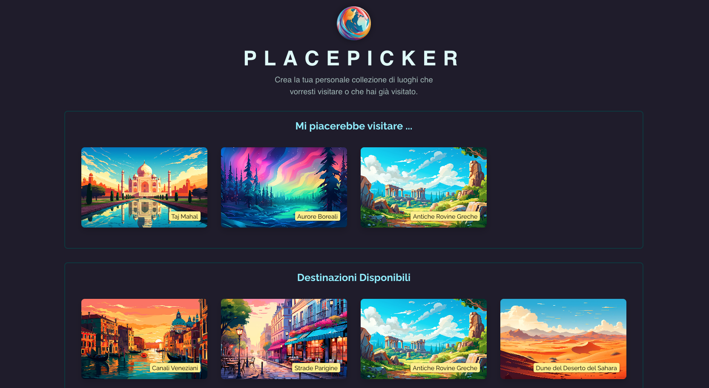

# PlacePicker 🗺️✨

**PlacePicker** è una web app sviluppata con React che permette all’utente di selezionare le destinazioni che desidera visitare.



Le destinazioni vengono mostrate in ordine di distanza dalla posizione dell’utente, rendendo la scelta più contestuale e interattiva.  
Ogni meta selezionata può essere salvata nel backend tramite richieste HTTP, per esercitare la gestione delle API in React.

## Funzionalità principali

- Visualizzazione delle destinazioni ordinate per distanza geografica
- Selezione delle destinazioni preferite
- Salvataggio delle destinazioni tramite richieste HTTP a un backend
- Interfaccia reattiva e moderna

## Tecnologie utilizzate

- React
- useState & useEffect
- useRef
- useCallback
- HTTP requests con `fetch()`
- Geolocalizzazione dell’utente
- Backend mock per la persistenza dei dati

## Installazione

Per eseguire il progetto in locale:

```bash
git clone https://github.com/leonardoLoddo/place-picker-http-requests
cd place-picker-http-requests
npm install
npm run dev
node backend/app.js
```

## Crediti

Progetto sviluppato da Leonardo Loddo, web developer e insegnante di sviluppo.
